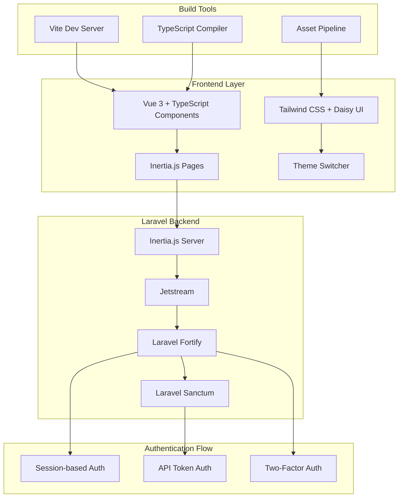

# Design Document

## Overview

The Laravel Modern Starter Kit is a comprehensive foundation for building modern web applications using the latest versions of Laravel, Jetstream, Inertia.js, Vue 3, TypeScript, Sanctum, Fortify, Tailwind CSS, Daisy UI, and Vite. The starter kit provides a seamless integration between backend authentication services and a modern frontend stack with custom theming capabilities.

## Architecture

### High-Level Architecture



### Technology Stack Integration

- **Laravel 12.x**: Core framework providing robust backend functionality
- **Jetstream 5.x**: Authentication scaffolding with team management features
- **Fortify**: Headless authentication backend handling login, registration, password reset
- **Sanctum**: API authentication for both SPA and mobile applications
- **Inertia.js**: Server-side routing with client-side rendering capabilities
- **Vue 3**: Modern reactive frontend framework with Composition API
- **Pinia**: Official state management library for Vue 3 with TypeScript support
- **TypeScript**: Type safety for enhanced development experience
- **Vite 7.x**: Fast build tool with HMR for development
- **Tailwind CSS 4.x**: Utility-first CSS framework
- **Daisy UI 5.x**: Component library with theming system

## Components and Interfaces

### Authentication Components

#### Fortify Integration
Based on the reference implementation, Fortify will be configured to handle:
- User registration with email verification
- Login with session and API token support
- Password reset functionality
- Two-factor authentication
- Profile management

#### Sanctum Configuration
- API token authentication for mobile/API clients
- Session-based authentication for web clients
- Middleware configuration for hybrid authentication

#### Custom Response Handlers
```typescript
// Custom response interfaces for API consistency
interface AuthResponse {
  user: User;
  token?: string;
  message: string;
}

interface ProfileUpdateResponse {
  user: User;
  message: string;
}
```

### Frontend Components

#### Core Vue Components
- **AuthenticationLayout**: Base layout for login/register pages
- **AppLayout**: Main application layout with navigation
- **ProfileDropdown**: User profile management dropdown
- **ThemeSwitcher**: Daisy UI theme selection component
- **NavigationMenu**: Responsive navigation with mobile support

#### Pinia Store Structure
```typescript
// stores/auth.ts
export const useAuthStore = defineStore('auth', () => {
  const user = ref<User | null>(null);
  const isAuthenticated = computed(() => !!user.value);
  
  const setUser = (userData: User) => {
    user.value = userData;
  };
  
  const logout = () => {
    user.value = null;
  };
  
  return { user, isAuthenticated, setUser, logout };
});

// stores/theme.ts
export const useThemeStore = defineStore('theme', () => {
  const currentTheme = ref('light');
  const availableThemes = ref<ThemeConfig[]>([]);
  
  const setTheme = (theme: string) => {
    currentTheme.value = theme;
    document.documentElement.setAttribute('data-theme', theme);
    localStorage.setItem('theme', theme);
  };
  
  const loadTheme = () => {
    const savedTheme = localStorage.getItem('theme') || 'light';
    setTheme(savedTheme);
  };
  
  return { currentTheme, availableThemes, setTheme, loadTheme };
});
```

#### Theme Management
```typescript
interface ThemeConfig {
  name: string;
  displayName: string;
  colors: {
    primary: string;
    secondary: string;
    accent: string;
    neutral: string;
  };
}
```

### Inertia.js Integration

#### Page Components Structure
```
resources/js/Pages/
├── Auth/
│   ├── Login.vue
│   ├── Register.vue
│   ├── ForgotPassword.vue
│   └── VerifyEmail.vue
├── Profile/
│   ├── Show.vue
│   ├── Partials/
│   │   ├── UpdateProfileInformationForm.vue
│   │   ├── UpdatePasswordForm.vue
│   │   └── DeleteUserForm.vue
├── Dashboard.vue
└── Welcome.vue
```

#### Type Definitions for Inertia Props
```typescript
interface User {
  id: number;
  name: string;
  email: string;
  email_verified_at: string | null;
  profile_photo_url: string;
  two_factor_enabled: boolean;
}

interface PageProps {
  auth: {
    user: User;
  };
  flash: {
    message?: string;
    error?: string;
  };
  errors: Record<string, string>;
}
```

## Data Models

### User Model Extensions
```php
class User extends Authenticatable implements MustVerifyEmail
{
    use HasApiTokens, HasFactory, HasProfilePhoto, Notifiable, TwoFactorAuthenticatable;

    protected $fillable = [
        'name',
        'email',
        'password',
    ];

    protected $hidden = [
        'password',
        'remember_token',
        'two_factor_recovery_codes',
        'two_factor_secret',
    ];

    protected $casts = [
        'email_verified_at' => 'datetime',
    ];

    protected $appends = [
        'profile_photo_url',
    ];
}
```

### Theme Configuration Model
```php
class ThemeConfiguration extends Model
{
    protected $fillable = [
        'user_id',
        'theme_name',
        'custom_colors',
        'is_active',
    ];

    protected $casts = [
        'custom_colors' => 'array',
        'is_active' => 'boolean',
    ];

    public function user()
    {
        return $this->belongsTo(User::class);
    }
}
```

## Error Handling

### API Error Responses
```typescript
interface ApiError {
  message: string;
  errors?: Record<string, string[]>;
  status: number;
}

class ApiErrorHandler {
  static handle(error: AxiosError): ApiError {
    if (error.response?.status === 422) {
      return {
        message: 'Validation failed',
        errors: error.response.data.errors,
        status: 422
      };
    }
    
    return {
      message: error.message || 'An unexpected error occurred',
      status: error.response?.status || 500
    };
  }
}
```

### Frontend Error Handling
- Form validation errors displayed inline
- Global error notifications using toast system
- Network error handling with retry mechanisms
- Authentication error redirects

### Backend Error Handling
- Custom exception handlers for API responses
- Validation error formatting for Inertia.js
- Authentication failure responses
- Rate limiting error messages

## Testing Strategy

### Backend Testing
- **Feature Tests**: Authentication flows, profile management, API endpoints
- **Unit Tests**: Custom actions, response handlers, model methods
- **Integration Tests**: Fortify and Sanctum integration

### Frontend Testing
- **Component Tests**: Vue component functionality using Vue Test Utils
- **E2E Tests**: Complete user workflows using Cypress or Playwright
- **Type Checking**: TypeScript compilation and type safety validation

### Test Structure
```
tests/
├── Feature/
│   ├── AuthenticationTest.php
│   ├── ProfileManagementTest.php
│   └── ThemeManagementTest.php
├── Unit/
│   ├── Actions/
│   └── Models/
└── Browser/
    ├── AuthenticationTest.php
    └── ThemeManagementTest.php
```

## Build and Development Configuration

### Vite Configuration
```typescript
// vite.config.ts
export default defineConfig({
  plugins: [
    laravel({
      input: 'resources/js/app.ts',
      refresh: true,
    }),
    vue({
      template: {
        transformAssetUrls: {
          base: null,
          includeAbsolute: false,
        },
      },
    }),
  ],
  resolve: {
    alias: {
      '@': '/resources/js',
    },
  },
});
```

### TypeScript Configuration
```json
{
  "compilerOptions": {
    "target": "ES2020",
    "useDefineForClassFields": true,
    "lib": ["ES2020", "DOM", "DOM.Iterable"],
    "module": "ESNext",
    "skipLibCheck": true,
    "moduleResolution": "bundler",
    "allowImportingTsExtensions": true,
    "resolveJsonModule": true,
    "isolatedModules": true,
    "noEmit": true,
    "jsx": "preserve",
    "strict": true,
    "noUnusedLocals": true,
    "noUnusedParameters": true,
    "noFallthroughCasesInSwitch": true,
    "baseUrl": ".",
    "paths": {
      "@/*": ["resources/js/*"]
    }
  },
  "include": ["resources/js/**/*.ts", "resources/js/**/*.vue"],
  "references": [{ "path": "./tsconfig.node.json" }]
}
```

### Tailwind and Daisy UI Configuration
```javascript
// tailwind.config.js
module.exports = {
  content: [
    './vendor/laravel/framework/src/Illuminate/Pagination/resources/views/*.blade.php',
    './storage/framework/views/*.php',
    './resources/views/**/*.blade.php',
    './resources/js/**/*.vue',
  ],
  theme: {
    extend: {},
  },
  plugins: [
    require('@tailwindcss/forms'),
    require('@tailwindcss/typography'),
    require('daisyui'),
  ],
  daisyui: {
    themes: [
      'light',
      'dark',
      'cupcake',
      'bumblebee',
      'emerald',
      'corporate',
      'synthwave',
      'retro',
      'cyberpunk',
      'valentine',
      'halloween',
      'garden',
      'forest',
      'aqua',
      'lofi',
      'pastel',
      'fantasy',
      'wireframe',
      'black',
      'luxury',
      'dracula',
      'cmyk',
      'autumn',
      'business',
      'acid',
      'lemonade',
      'night',
      'coffee',
      'winter',
      // Custom themes will be added here
    ],
  },
};
```

## Security Considerations

### Authentication Security
- CSRF protection for web routes
- Rate limiting on authentication endpoints
- Secure password hashing using bcrypt
- Two-factor authentication support
- Email verification requirements

### API Security
- Sanctum token authentication
- Token expiration and rotation
- API rate limiting
- CORS configuration for SPA

### Frontend Security
- XSS protection through Vue's template system
- Content Security Policy headers
- Secure cookie configuration
- Input sanitization and validation